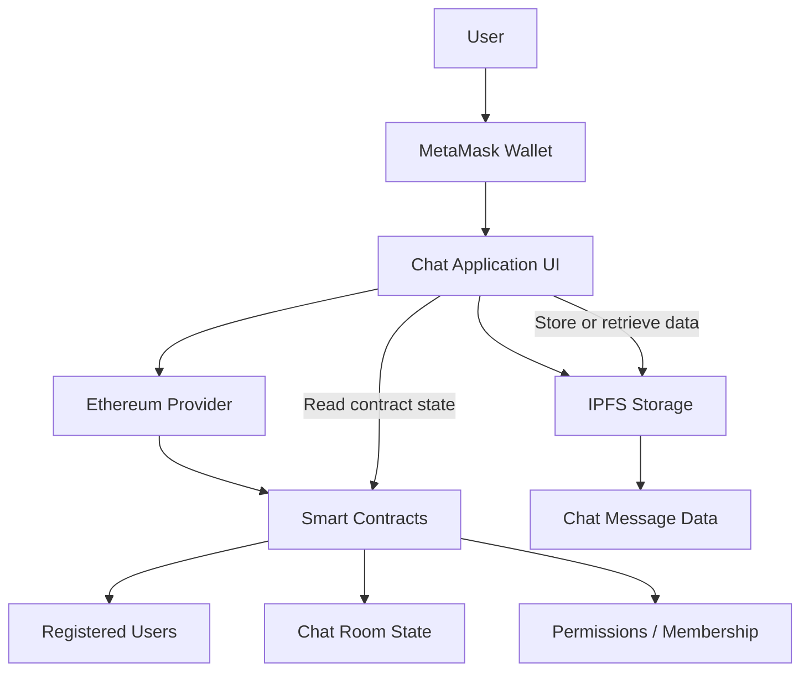
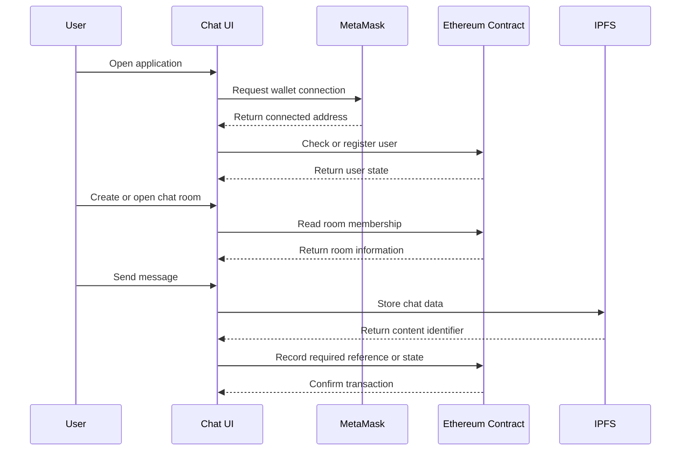

<div align="center">

# 🔐 Decentralized Chat Application

### Wallet-based messaging with Ethereum identity and IPFS-backed chat storage

<p>
  
  
  
  
  
</p>

<p>
  <a href="#-overview">Overview</a> •
  <a href="#-features">Features</a> •
  <a href="#-architecture">Architecture</a> •
  <a href="#-getting-started">Getting started</a> •
  <a href="#-roadmap">Roadmap</a>
</p>

</div>

---

## 🌍 Overview

The **Decentralized Chat Application** explores a messaging model without traditional username-and-password accounts or a central message database.

Users authenticate through a cryptocurrency wallet such as MetaMask. Wallet addresses act as decentralized identities, while chat data is designed to be stored through IPFS.

The project combines:

- wallet-based authentication
- Ethereum smart contracts
- private and group chat rooms
- decentralized message storage
- Hardhat-based contract development
- Sepolia test-network deployment support

---

## ✨ Features

<table>
<tr>
<td width="50%" valign="top">

### 👛 Wallet-based identity

Users connect with MetaMask instead of creating a traditional account with a password.

</td>
<td width="50%" valign="top">

### 💬 Chat rooms

Registered wallet users can create or join rooms for private and group conversations.

</td>
</tr>

<tr>
<td width="50%" valign="top">

### 🌐 Decentralized storage

Chat data is designed to be stored through IPFS rather than a single central server.

</td>
<td width="50%" valign="top">

### ⛓️ Smart-contract integration

Ethereum contracts coordinate decentralized application state and wallet interactions.

</td>
</tr>

<tr>
<td width="50%" valign="top">

### 🧪 Local blockchain development

Hardhat supports local contract compilation, testing, deployment, and debugging.

</td>
<td width="50%" valign="top">

### 🚀 Sepolia configuration

The repository includes configuration for deploying contracts to the Ethereum Sepolia test network.

</td>
</tr>
</table>

---

## 🧠 Why decentralize chat?

Traditional chat systems commonly depend on:

- a central identity provider
- a central application server
- a central message database
- platform-controlled access to user data

This project experiments with a different model:

| Traditional approach | Decentralized approach |
|---|---|
| Email or username identity | Wallet-address identity |
| Password-based login | Wallet signature or connection |
| Central message database | IPFS-backed data |
| Platform-controlled state | Smart-contract-managed state |
| Single infrastructure owner | Distributed network components |

This does not automatically make an application private or secure. Encryption, access control, key management, moderation, and metadata protection still require careful design.

---

## 🧱 Architecture



### Main layers

<table>
<tr>
<td width="33%" valign="top">

### Identity layer

MetaMask provides the connected wallet address used to identify the user.

</td>
<td width="33%" valign="top">

### Contract layer

Solidity contracts maintain application state and support blockchain interactions.

</td>
<td width="33%" valign="top">

### Storage layer

IPFS provides content-addressed, decentralized storage for chat data.

</td>
</tr>
</table>

---

## 🔄 User flow



---

## 🛠️ Tech stack

| Area | Technology |
|---|---|
| Smart contracts | Solidity 0.8.19 |
| Blockchain tooling | Hardhat 2.19 |
| Contract utilities | Hardhat Toolbox |
| Deployment | Hardhat Ignition |
| Wallet integration | MetaMask |
| Test network | Ethereum Sepolia |
| Decentralized storage | IPFS |
| Environment configuration | dotenv |
| Optional 3D interface dependencies | React Three Fiber, Drei |

---

## 📂 Repository structure

```text
decentralised_chatapp/
├── contracts/                 Solidity smart contracts
├── ignition/                  Hardhat Ignition deployment modules
├── scripts/                   Contract deployment scripts
├── test/                      Smart-contract tests
├── frontend/ or app files/    User interface and wallet integration
├── hardhat.config.js          Blockchain and network configuration
├── package.json               JavaScript dependencies
└── README.md
```

> The exact interface folder may differ in the repository. The blockchain development layer is configured at the project root.

---

## ⚙️ Network configuration

The Hardhat configuration uses:

```text
Default network: Hardhat
Solidity version: 0.8.19
Test network: Sepolia
Chain ID: 11155111
Confirmations: 6
```

Sepolia credentials are loaded through environment variables:

```env
RPC_URL=your_sepolia_rpc_url
PRIVATE_KEY=your_deployment_wallet_private_key
```

> Never commit a real wallet private key. Use a dedicated test wallet with no valuable assets.

---

## 🚀 Getting started

### Prerequisites

Install:

- Node.js
- npm
- Git
- MetaMask
- access to an Ethereum RPC provider for Sepolia
- test Sepolia ETH for deployment

### Clone the repository

```bash
git clone https://github.com/Manyfaces860/decentralised_chatapp.git
cd decentralised_chatapp
```

### Install dependencies

```bash
npm install
```

### Create the environment file

Create `.env` in the repository root:

```env
RPC_URL=https://your-sepolia-rpc-endpoint
PRIVATE_KEY=your_test_wallet_private_key
```

Do not include the `0x` prefix unless your deployment setup expects it.

---

## 🧪 Hardhat commands

### View available commands

```bash
npx hardhat help
```

### Compile contracts

```bash
npx hardhat compile
```

### Run tests

```bash
npx hardhat test
```

### Run tests with gas reporting

```bash
REPORT_GAS=true npx hardhat test
```

### Start a local blockchain node

```bash
npx hardhat node
```

### Deploy locally

In another terminal:

```bash
npx hardhat run scripts/deploy.js --network localhost
```

### Deploy to Sepolia

```bash
npx hardhat run scripts/deploy.js --network sepolia
```

When the repository uses an Ignition deployment module, deploy with:

```bash
npx hardhat ignition deploy ./ignition/modules/<module-name>.js --network sepolia
```

Replace `<module-name>` with the actual deployment module filename.

---

## 🔐 Security and privacy considerations

A decentralized architecture does not guarantee confidentiality by itself.

Before storing chat messages on IPFS, a production implementation should consider:

### Message encryption

Messages should be encrypted before upload. Public IPFS content can be retrieved by anyone who knows the content identifier.

### Key management

The application needs a secure method for distributing, rotating, and revoking encryption keys for room members.

### On-chain privacy

Data stored directly on a public blockchain is visible permanently. Sensitive message content should not be written on-chain.

### Metadata leakage

Even encrypted messages can reveal information such as:

- wallet addresses
- timestamps
- room membership
- transaction frequency
- message sizes

### Smart-contract security

Contracts should be tested for:

- unauthorised room access
- incorrect membership updates
- duplicate registration
- denial-of-service risks
- unbounded loops
- event and state inconsistencies

### Wallet safety

Users should never be asked to reveal their seed phrase or private key.

---

## 🧪 Recommended test cases

- user registration with a wallet
- duplicate registration attempt
- creating a chat room
- adding authorised members
- blocking unauthorised room access
- sending and retrieving an IPFS message reference
- opening an existing room
- handling a rejected wallet transaction
- switching wallet accounts
- switching to an unsupported network
- unavailable IPFS content
- invalid content identifier
- contract deployment to a local network
- contract deployment to Sepolia

---

## 🚧 Current limitations

This project is an educational decentralized application and should not be treated as a production-ready secure messenger.

Potential limitations include:

- incomplete end-to-end encryption
- public blockchain metadata
- no moderation or abuse controls
- dependence on wallet availability
- IPFS persistence and pinning requirements
- transaction fees on live networks
- no recovery when a user loses wallet access
- limited automated contract tests
- no formal smart-contract audit

---

## 🗺️ Roadmap

- [x] Wallet-based user identity
- [x] Hardhat development environment
- [x] Solidity contract setup
- [x] Sepolia network configuration
- [x] Chat-room concept
- [x] IPFS storage design
- [ ] IPFS pinning service integration
- [ ] Expanded smart-contract tests
- [ ] Transaction-status feedback
- [ ] Group administration controls
- [ ] Message attachment support

---

## 🎓 What this project demonstrates

- Ethereum smart-contract development
- Solidity and Hardhat workflows
- wallet-based authentication
- decentralized identity concepts
- IPFS storage architecture
- test-network deployment
- Web3 security trade-offs
- integration between blockchain, storage, and application layers

---

## 👤 Author

<div align="center">

### Abhishek Gupta

<p>
  <a href="https://github.com/Manyfaces860">
    
  </a>
  <a href="https://www.linkedin.com/in/abhishek-gupta-ab377b305/">
    
  </a>
</p>

</div>

---

<div align="center">

### Wallet identity. Smart-contract state. Decentralized storage.

</div>
